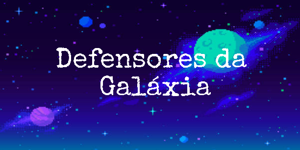
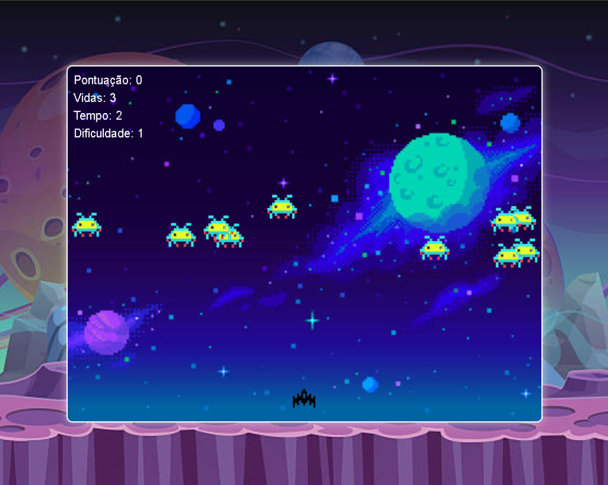

# Defensores da Galáxia

# Link do video (https://youtu.be/WRucU5n9DUc)

## 🍁 Sobre o repositório
Este repositório contém a documentação e demonstração do jogo criado na disciplina de Computabilidade e Complexidade de Algoritmos - Centro Universitário do Distrito Federal, durante o 6° semestre.

## 👥 Participantes
- 👩‍🏫 Prof. Kadidja Valéria
- 👤 Sávio Guimarães Saraiva - 30359201

## 📰 Sobre o Jogo
 *Defensores da Galáxia*: È uma emocionante aventura espacial em 2D, onde você assume o controle de uma nave poderosa para enfrentar hordas de alienígenas e proteger a galáxia. Desenvolvido em JavaScript, este jogo oferece horas de diversão com jogabilidade viciante, gráficos coloridos e efeitos sonoros envolventes.
 
 

## 💡 Inspiração
Foram utilizados como inspiração alguns jogos em universo 2D.

 *Ikaruga*: esenvolvido por um dos principais nomes do gênero, a Treasure, Ikaruga foi lançado nos arcades em 2001.

 *Radiant Silvergun*: jOutra criação da Treasure e que serviu como base para o fantástico Ikaruga, Radiant Silvergun saiu inicialmente nos fliperamas e depois acabou sendo adaptado para o SEGA Saturn.

 *G-Darius*: A franquia Darius sempre foi conhecida por duas características: chefes que pareciam peixes robotizados e cujo tamanho os impediam de aparecer totalmente na tela.

## ⚙️ Tecnologias
 *VSCode*: O Visual Studio Code (VS Code) é um editor de código-fonte extremamente popular e versátil, desenvolvido pela Microsoft..
 
 *HTML*: È a sigla para HyperText Markup Language, ou Linguagem de Marcação de Hipertexto em português. É a linguagem padrão utilizada para criar a estrutura das páginas da web..

 *CSS*: È a sigla para Cascading Style Sheets, ou Folhas de Estilo em Cascata em português. Se o HTML é a estrutura de uma página da web, o CSS é a roupa que a veste, definindo a aparência visual de todos os elementos.

 *JavaScript*: JavaScript: A Alma das Páginas Web
JavaScript é uma linguagem de programação que permite que você adicione interatividade e dinâmica às suas páginas web.

## ♾️ Complexidade
 *Pontuação*: pontos são adquiridos ao derrotar inimigos. 
 
 *Tempo*: a partir de um tempo limite e do sistema de pontos, o jogo desafia o jogador a conseguir a maior quantidade de pontos.

 *Vida*: ganhar ou perder depende da vida. O jogador terá 3 chances de tentar chegar até o boss e eliminalo.

## 🎮 Jogabilidade
 *Movimentação*: o jogo é em perspectiva 2D com uma visão de cima. O jogador se mexe utilizando as teclas (W, A, S, D) e pode atirar clicando a tecla (Espaço).
 
## 📝 CheckList

*Fase 1: Análise*
- [ Savio ] Problema selecionado e definido claramente.

*Fase 2: Planejamento* 
- [ Sávio ] Game estilo
- [ Sávio ] Escolha em desenvolver em VS CODE.
- [ Sávio ] Desenvolvimento do game em JavaScript.
- [ Sávio ] Estrutura geral do algoritmo esboçada.

*Fase 3: Programação e Testes*
- [ Sávio ] Código de programação escrito de forma clara e organizada.
- [ Sávio ] Testes rigorosos realizados em uma variedade de casos de teste.
- [ Sávio ] Casos limite e situações especiais testados.
- [ Sávio ] Erros e problemas durante o teste de programa identificados e corrigidos.

*Fase 4: Documentação e Avaliação do Projeto* 
- [ Sávio ] Documentação completa, incluindo especificação do algoritmo e análise de complexidade.
- [ Sávio ] Documentação revisada para clareza e rigor técnico.
- [ Sávio ] Avaliação da eficácia do algoritmo em termos de tempo de execução, uso de recursos e precisão na resolução do problema.
- [ Sávio ] Avaliação da colaboração da equipe e cumprimento dos prazos.
